# Unit Testing Lab

## Overview

In this Lab, you will:

- start from a simple ConsoleApp implemented for testing and create simple Unit Test,
- Add a basic `Calculator` class and Unit Test its `Add()` method,
- use a TDD approach to implement the `Divide()` method in the Calculator,
- to end with wiring an external MS SQL database for tests values.

The aim is to browse quickly from simple to advanced Unit Tests capabilities.
The technologies used in this Lab are:

- Visual Studio 2022, with its MSSQLLocalDB SQL Server instance
- C# .NET 6
- MSTest V2

> Note:
>
> Visual Studio Enterprise Edition brings many features for Unit Testing, such as:
>
> - [Live Unit testing](https://learn.microsoft.com/en-us/visualstudio/test/live-unit-testing-intro?view=vs-2022)
> - [IntelliTest](https://learn.microsoft.com/en-us/visualstudio/test/intellitest-manual/?view=vs-2022)
> - [Microsoft Fakes](https://learn.microsoft.com/en-us/visualstudio/test/isolating-code-under-test-with-microsoft-fakes?view=vs-2022&tabs=csharp)
> - [Code coverage](https://learn.microsoft.com/en-us/visualstudio/test/using-code-coverage-to-determine-how-much-code-is-being-tested?view=vs-2022&tabs=csharp)
>
> The lab will not cover these features, but we will show some of them during the demos.

---

## Lab instructions

---

### 0. Setup the lab environment

To get started:

- Clone the repo locally: `git clone https://github.com/embergershared/ut-lab.git`

- Open the solution `/0.Start/UnitTestLab.sln` in Visual Studio

- See the solution content:

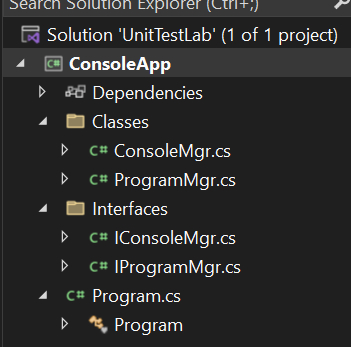

This ConsoleApp:

- Starts
- Displays a message
- Wait for an entry
- Reacts in 3 ways to the entry entered:
  1. Writes the text entered
  2. if `"Enter"` is typed, clears the screen
  3. if `"q"` is typed, exits the program

- Start it to check it runs:

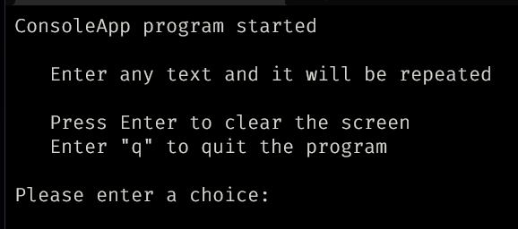

- Look at the way the `static Main()` in `Program.cs` initialize dependency injection then:
  - Start an instance of `IPogramMgr` with the `Run()` method,
  - And the `ProgramMgr` class gets an `IConsoleMgr` - a wrapper for the platform's Console - instance injected.

This allows to decouple the pieces with `seams` and enables easier testing.

### Add a MSTest project to the solution

You will create a Unit Test with MSTestV2 to test the `ConsoleMgr.WriteLine(string value)` method.

- Add a new Project to the solution:
  - `Project type: MSTest Test Project`
  - `Project name: ConsoleAppTests`
  - `Framework: .NET 6.0 (LTS)`

- In `ConsoleAppTests` project, right click on `Dependencies` and `Add Project Reference` to the project `ConsoleApp`
  > This makes our ConsoleApp code available for our tests.

- Open project `ConsoleAppTests` properties (Alt + Enter) and:

  - Select `Global Usings / General`
  - Uncheck `Implicit global usings | Enable implicit global usings to be declared by the project SDK`

  > This allows to see all the dependencies explicitly in the code.

- Delete `Usings.cs` file

- Add `using Microsoft.VisualStudio.TestTools.UnitTesting;` on the first line of the `UnitTest1.cs` file

- File / Save All.

---

### 1. 1st Unit Test

- Rename `UnitTest1.cs` file to `ConsoleMgrShould.cs`
- Accept Visual Studio rename all references by clicking `Yes`

  > It is recommended to name a test class `"<ClassUnderTestName>Should"`.

- Delete the method `TestMethod1()`

- Create the following Test method in `ConsoleMgrShould.cs`:

```cs
    [TestMethod]
    public void WriteLine_WritesToSystemConsole()
    {
        // Arrange

        // Act

        // Assert
        Assert.Inconclusive();
    }
```

  > This simple unit test method has the structure recommended for a Unit Test:
  >
  > - Its name starts by the method it tests, then a name related to the test
  >
  > - The 3 steps of a Unit Test are separated
  >
  > - Adding Assert.Inconclusive() will make the test `Skipped` but remind you that the test is not doing anything (yet)

- Run `Test / Run All Tests` from Visual Studio Menu and check in the Test Explorer the result:

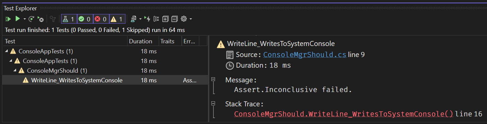

- Replace the code in the test method for:

```cs
    [TestMethod]
    public void WriteLine_WritesToSystemConsole()
    {
        // Arrange
        const string expected = "Hello to the console";
        var sut = new ConsoleMgr();

        using var sw = new StringWriter();
        Console.SetOut(sw);

        // Act
        sut.WriteLine(expected);
        var actual = sw.ToString();

        // Assert
        Assert.AreEqual(expected, actual);
    }
```

  > The variable `sut` stands for `System Under Test`. With this convention, we easily know what is tested in the unit test code.
  >
  > The `expected` and `actual` (or `result`) variables' names are usual names used in unit testing. It helps distinguish right away the elements for the `Assert`.

- Run `Test / Run All Tests`

- The test fails

- Let's debug the test:

  - Put a breakpoint (F9) on the line `var actual = ...`

  - In the Test Explorer, right-click on the test and launch `Debug`:

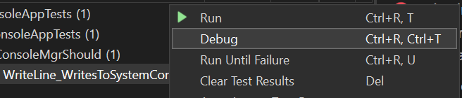

  - You can see in the breakpoint that we get an object that may not render back our expected variable as we don't control the formatting of the `.ToString()` extension

  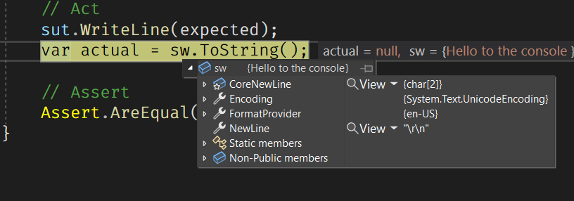

  - To fix the test: add `.Trim()` after the `.ToString()` for the actual value

    > The line should now be: `var actual = sw.ToString().Trim();`

- Run `Test / Run All Tests`

- Check the test `Passed`.

  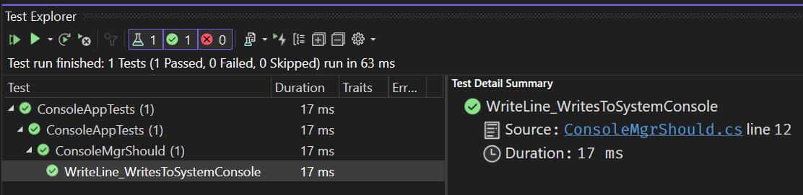

---

### 2. Unit Testing a Calculator

In this exercise, we will create and test a very simple calculator to explore:

- Test for exception(s) in Unit Tests
- Use multiple data in a test (Data-driven testing)
- Create the tests before the Method implementation (TDD)

Let's get started:

#### Test for Exception(s)

- Create a new Class `Calculator.cs` in the `ConsoleApp` project's `Classes` folder

- Make the class `public`

- Create the `Add` method in the Calculator class:

```cs
    public double Add(double a, double b)
    {
        throw new NotImplementedException();
    }
```

- Create a new Class `CalculatorShould.cs` in the `ConsoleAppTests` project

- Make the class `public`

- Add the `[TestClass]` attribute to the class (just above the `public class` declaration)

  > This attribute tells MSTestV2 to include this class in its tests

- Now create the TestMethod:

  - From the template:

```cs
    [TestMethod]
    public void Add_TwoValues_ThrowAnException()
    {
        // Arrange

        // Act

        // Assert
        Assert.Inconclusive();
    }
```

  - Create this test:

```cs
    // [Ignore]
    [TestMethod]
    [Description("Check for a thrown NotImplementedException using TryCatch.")]
    public void Add_TwoValues_ThrowAnException()
    {
        // Arrange
        var sut = new Calculator();

        try
        {
          // Act
          sut.Add(2, 3);
        }
        // Assert
        catch (NotImplementedException)
        {
            // Test succeeded
            return;
        }

        // Test failed
        Assert.Fail("Call to Add(2, 3) did NOT throw an NotImplementedException");
    }
```

- Run All tests

- See that the test `Passed` as we expect an Exception of type `NotImplementedException` and receive it:

  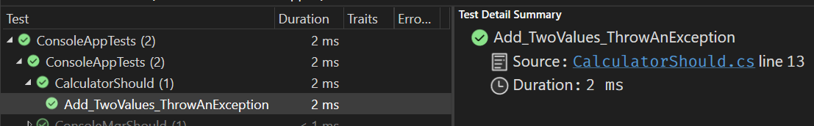

    > The other way to test for an `Exception` is to use the attribute `[ExpectedException(typeof(NotImplementedException))]`
    >
    > For fun, replace the `throw new NotImplementedException();` by `throw new ArgumentNullException();` and see that the test `Fail`

#### Use a Data-driven test

Let's implement the `Add(a, b)` method in `Calculator.cs`:

- Replace the line `"throw new NotImplementedException();"` with `"return a + b;"`

  ```cs
          public double Add(double a, double b)
          {
              return a + b;
          }
  ```

  > Note: Now the test `Add_TwoValues_ThrowAnException()` Fails

- In `CalculatorShould.cs` class, uncomment the attribute `// [Ignore]` for the `Add_TwoValues_ThrowAnException()` test

- When running the test, it is now `Skipped`

    > The `[Ignore]` attribute can be helpful, but should be used as a temporary approach while building the implementations and their tests. Skipped tests should not stay in code.

- Delete the method `Add_TwoValues_ThrowAnException()`

- Create a new method: `Add_TwoValues_Calculates()`:

```cs
    [TestMethod]
    [Description("Testing Calculator.Add() with multiple values.")]
    [Owner("Emmanuel")]
    [Priority(2)]
    [TestCategory("NormalValues")]
    [DataRow(6, 2, 8, DisplayName = "Test for (int) 6 + 2")]
    [DataRow(45.7, 12.89, 58.59, DisplayName = "Test for (double) 45.7 + 12.89")]
    [DataRow(double.MaxValue, 100, double.MaxValue, DisplayName = "Test for (double) MaxValue")]
    public void Add_TwoValues_Calculates(double a, double b, double expected)
    {
        // Arrange
        var sut = new Calculator();

        // Act
        var actual = sut.Add(a, b);

        // Assert
        Assert.AreEqual(expected, actual);
    }
```

- Run the Test and see few differences:

  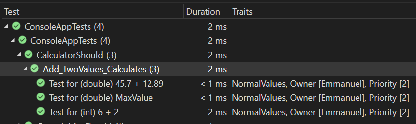

> Notice:
>
> - The attributes `[Owner()]`, `[Priority()]` & `[TestCategory()]` generates `Traits` that can be used later to filter the tests, like in `dotnet test [] --filter "Priority=2"`.
>
> - The attribute `[Description()]` is added to the `TestContext` and we'll use it later
>
> - The `[DataRow()]` attribute allows us to pass data as an `object[]` type. Each attribute generates a test of the test method. The `DisplayName` argument allows to differentiate the tests instances in the display, as one or more can `Fail`
>
> - Notice that we also test the "edge" cases with the `double.MaxValue` value

#### Create the Tests before the implementation (or TDD)

This example is not an introduction to Test-Driven Development. It is just an awareness exercise.

We will implement a `Divide()` method for the `Calculator` class.

To do that, let's think about the tests that support the **behavior** we want to achieve:

- What should happen when we "divide `10` by `2`?" => we get `5`
- What should happen when we "divide `34.67` by `9.6`?" => we get `3.6114583333...`
- What should happen when we "divide `_anything_` by `0`?" => we decide we want to get `0`
- What should happen when we "divide `10` by `-5`?" => we get `-2`

We can create the tests for that:

```cs
    [TestMethod]
    [Description("Testing Calculator.Divide() with multiple values.")]
    [Owner("Emmanuel")]
    [Priority(2)]
    [TestCategory("NormalValues")]
    [DataRow(10, 2, 5, DisplayName = "Test for 10 / 5")]
    [DataRow(34.67, 9.6, 3.6114, DisplayName = "Test for 34.67 / 9.6")]
    [DataRow(56, 0, 0, DisplayName = "Test for 56 / 0")]
    [DataRow(10, -5, -2, DisplayName = "Test for 10 / -5")]
    public void Divide_TwoValues_Calculates(double a, double b, double expected)
    {
        // Arrange
        var sut = new Calculator();

        // Act
        var actual = sut.Divide(a, b);

        // Assert
        Assert.AreEqual(expected, actual);
    }
```

The build of `ConsoleAppTests` now fails. Because the `Calculator` class does not contain a definition for the `Divide()` method. Let's implement it:

- Create the member method in the `Calculator` class with the "normal" code one would put:

```cs
    public double Divide(double a, double b)
    {
        return a / b;
    }
```

- Run the Tests to see the results:

    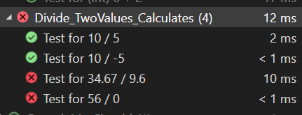

- Fix the failing tests, based on their details:

  - Rounding errors

    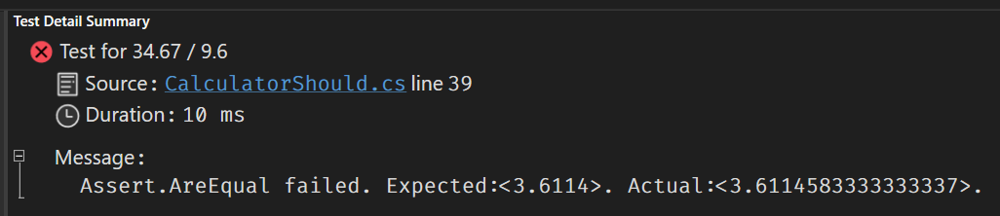

    For this test to pass, we have to set the `accuracy` of our test, by setting its `delta`.
    This change is done **in the test method**:

    - Add the `delta` argument to the Assert line: `Assert.AreEqual(expected, actual, 0.0001);`

    The accuracy should be adapted to the `Test data` provided to the test

  - Division by zero

    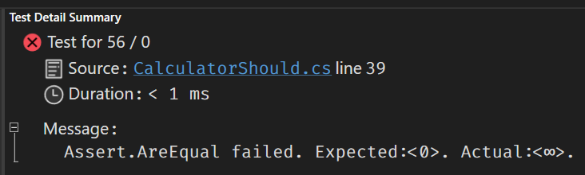

    For this test to pass, we need to edit our `Divide()` method implementation:

    ```cs
    public double Divide(double a, double b)
    {
        if (b != 0)
        {
            return a / b;
        }

        // Arbitrary decision to handle division by 0
        return 0;
    }
    ```

- Implement the changes in code

- See all the tests `Pass`:

    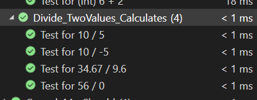

> Note:
>
> With Visual Studio Enterprise Edition:
>
> - You can see the code coverage of the classes (_Test / Analyze code coverage for All Tests_), in the `Code Coverage Results` view:
>
>    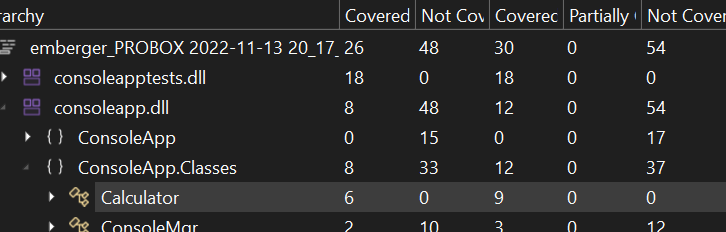
>
> - You can display colored lines and see which ones are covered by Unit Tests (blue ones being covered):
>
>   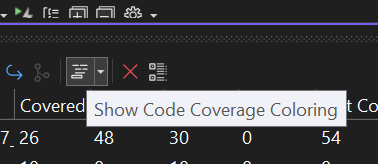
>
>   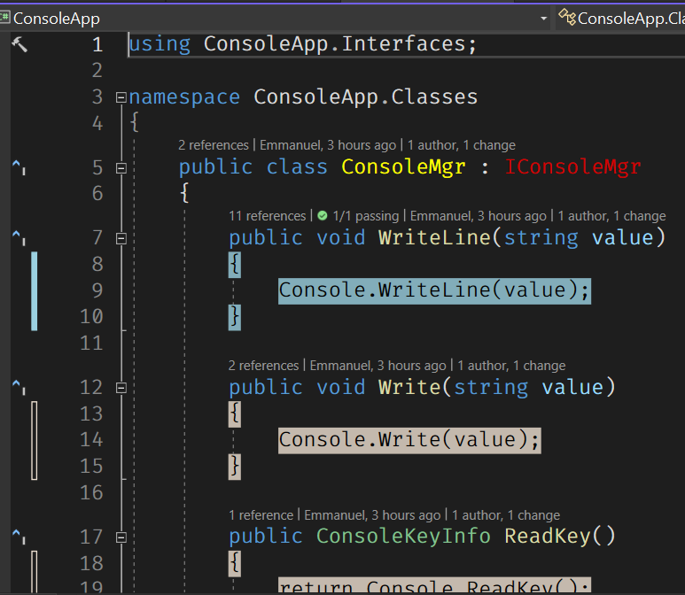
>
> - You can turn ON Live Unit Testing and see in real-time, in the code edited, the results of its associated tests:
>
>   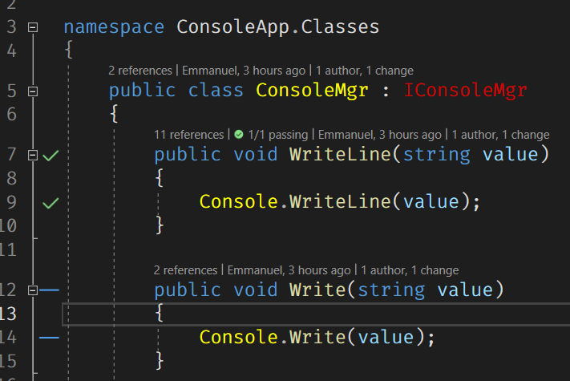
>


---


## References

To create this Lab for H&R Block's BAC team's DevOps continuous quality workshop, the following sources were used:

- [Testing in .NET](https://learn.microsoft.com/en-us/dotnet/core/testing/)
- [Unit testing C# with MSTest and .NET](https://learn.microsoft.com/en-us/dotnet/core/testing/unit-testing-with-mstest)
- [First look at testing tools in Visual Studio](https://learn.microsoft.com/en-us/visualstudio/test/improve-code-quality?view=vs-2022)
- [Pluralsight | Implementing C# 9 Unit Testing Using Visual Studio 2019 and .NET 5](https://app.pluralsight.com/library/courses/basic-unit-testing-csharp-developers/table-of-contents)
- [Pluralsight | Testing .NET Code with xUnit.net 2: Getting Started](https://app.pluralsight.com/library/courses/dotnet-core-testing-code-xunit-dotnet-getting-started/table-of-contents)
- [Tim Corey | Intro to Unit Testing in C# using xUnit](https://youtu.be/ub3P8c87cwk)
